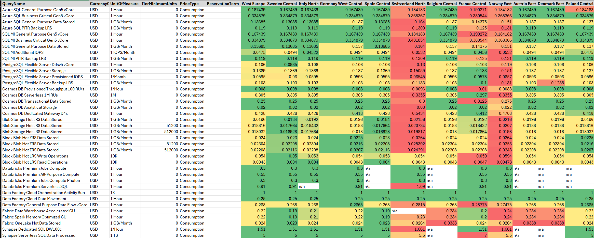

# How does pricing for a given set of Azure services compare across regions?

The [Azure retail pricing API](https://learn.microsoft.com/en-us/rest/api/cost-management/retail-prices/azure-retail-prices) can give you detailed information on how Azure services are priced across regions. The PowerShell cmdlet below uses the API to create a kind of "pricing index" for the Azure services and regions you are interested in. It gives you an indication of how the factors driving pricing for these Azure services are priced differently across regions (for a pricing estimate, you'd need to scale up all the "per-unit" price factors for actual usage).

The intention of this project is to help you answer important questions like:
* Is Sweden Central more expensive to run the same services than West Europe?
* Could I save money by using France Central instead?
* Are there some Azure services that are more expensive for a given region even though it is cheaper overall (e.g. Sweden Central)?



## Pricing drivers
You will need to break down each service into the different components that drive its pricing.  The table below shows major pricing components for Azure services commonly used by Enterprise clients.

| Service | Major price drivers |
| --- | --- |
| Azure SQL Database | compute tier, provisioned/serverless model, data storage, and backup storage |
| Azure SQL Managed Instance | compute tier, data storage, IOPS, and backup storage |
| Azure Database for PostgreSQL Flexible Server | compute, storage, IOPS, and backup storage |
| Azure Cosmos DB | provisioned/serverless throughput, transactional/analytical storage, and gateway compute |
| Storage account | redundancy, access tier, capacity, and transaction class |
| Azure Databricks | DBUs by workload, tier, and serverless/classic execution model |
| Azure Data Factory | orchestration, data movement, and mapping data flow compute |
| Microsoft Fabric | workload CU usage and OneLake storage |
| Azure Synapse Analytics | dedicated/serverless SQL, Spark, pipelines, and backup storage |
| Azure Key Vault | standard operations, cryptographic operations, and managed HSM capacity |
| Azure App Service | plan size, operating system, instance hours |
| API Management | call consumption and provisioned gateway units |
| Event Grid | event/MQTT operations and namespace throughput |
| Event Hubs | ingress events, throughput/processing units, and capture |
| Azure Cache for Redis | legacy cache tier and size |
| Azure Managed Redis | workload family, memory/compute balance, and cache size |
| Azure Service Bus | standard operations/base capacity and premium messaging units |
| Microsoft Foundry | model deployment type, input/output tokens, and hosted agent compute/memory |
| Azure AI Search | search units, semantic ranker, and enrichment |
| Recovery Services vault | protected instances, backup storage, and Site Recovery replicas |

Below are some example resource queries that use the pricing drivers above.  Each resource query must include at least one selective field: `ProductName`, `SkuName`, `ArmSkuName`, or `MeterName`.  

Note: The Retail Prices API unfortunately doesn't always represent equivalent products, SKUs, meters, ARM SKUs consistently across regions. There may be slight differences in wording for the filter field values, resulting in false negatives (`n/a`) for a region even when that service is in fact supported. When writing new queries, you may therefore need to tweak the filters to find ones that are selective enough to retrieve prices for each supporting target region; remove or adjust one descriptive field at a time while retaining a stable meter or ARM SKU where possible.

## Creating resource queries
Create an array of regions and a hashmap containing the resource queries.  As mentioned above, these resource queries filter on one on or more [fields](https://learn.microsoft.com/en-us/rest/api/cost-management/retail-prices/azure-retail-prices#api-filters) to find the different components that drive pricing for each service. You don't need to include every single one of these, just the major ones. The idea here is to get an indication of how pricing compares across regions rather than produce a detailed pricing estimate for everything you're using.

``` PowerShell
$regions = @(
    "West Europe",
    "Sweden Central",
    "Italy North",
    "Germany West Central",
    "Spain Central",
    "Switzerland North",
    "Belgium Central",
    "France Central",
    "Norway East",
    "Austria East",
    "Denmark East",
    "Poland Central"
)

$queries = @(
    # Azure SQL Database: compute tier, provisioned/serverless model, data storage, and backup storage
    @{ Name = 'Azure SQL General Purpose Gen5 vCore'; ServiceName = 'SQL Database'; ProductName = 'SQL Database Single/Elastic Pool General Purpose - Compute Gen5'; ArmSkuName = 'SQLDB_GP_Compute_Gen5'; MeterName = 'vCore' },
    @{ Name = 'Azure SQL Business Critical Gen5 vCore'; ServiceName = 'SQL Database'; ProductName = 'SQL Database Single/Elastic Pool Business Critical - Compute Gen5'; ArmSkuName = 'SQLDB_BC_Compute_Gen5'; MeterName = 'vCore' },
    @{ Name = 'Azure SQL General Purpose Data Stored'; ServiceName = 'SQL Database'; ProductName = 'SQL Database Single/Elastic Pool General Purpose - Storage'; SkuName = 'General Purpose'; MeterName = 'General Purpose Data Stored' },
    @{ Name = 'Azure SQL PITR Backup LRS'; ServiceName = 'SQL Database'; SkuName = 'Backup LRS'; MeterName = 'LRS Data Stored' },

    # Azure SQL Managed Instance: compute tier, data storage, IOPS, and backup storage
    @{ Name = 'SQL MI General Purpose Gen5 vCore'; ServiceName = 'SQL Managed Instance'; ProductName = 'SQL Managed Instance General Purpose - Compute Gen5'; ArmSkuName = 'SQLMI_GP_Compute_Gen5'; MeterName = 'vCore' },
    @{ Name = 'SQL MI Business Critical Gen5 vCore'; ServiceName = 'SQL Managed Instance'; ProductName = 'SQL Managed Instance Business Critical - Compute Gen5'; ArmSkuName = 'SQLMI_BC_Compute_Gen5'; MeterName = 'vCore' },
    @{ Name = 'SQL MI General Purpose Data Stored'; ServiceName = 'SQL Managed Instance'; ProductName = 'SQL Managed Instance General Purpose - Storage'; SkuName = 'General Purpose'; MeterName = 'General Purpose Data Stored' },
    @{ Name = 'SQL MI Additional IOPS'; ServiceName = 'SQL Managed Instance'; ProductName = 'SQL Managed Instance General Purpose - Storage'; SkuName = 'Additional IOPS'; MeterName = 'Additional IOPS' },
    @{ Name = 'SQL MI PITR Backup LRS'; ServiceName = 'SQL Managed Instance'; ProductName = 'SQL Managed Instance PITR Backup Storage'; SkuName = 'Backup LRS'; MeterName = 'LRS Data Stored' },

    # Azure Database for PostgreSQL Flexible Server: compute, storage, IOPS, and backup storage
    @{ Name = 'PostgreSQL Flexible Server Ddsv5 vCore'; ServiceName = 'Azure Database for PostgreSQL'; ProductName = 'Azure Database for PostgreSQL Flexible Server General Purpose Ddsv5 Series Compute'; ArmSkuName = 'AzureDB_PostgreSQL_Flexible_Server_General_Purpose_Ddsv5Series_Compute_vCore'; MeterName = 'vCore' },
    @{ Name = 'PostgreSQL Flexible Server Storage'; ServiceName = 'Azure Database for PostgreSQL'; ProductName = 'Az DB for PostgreSQL Flexible Server Storage'; SkuName = 'Storage'; MeterName = 'Storage Data Stored' },
    @{ Name = 'PostgreSQL Flexible Server Provisioned IOPS'; ServiceName = 'Azure Database for PostgreSQL'; ProductName = 'Az DB for PostgreSQL Flexible Server Storage'; SkuName = 'IOPS Scaling'; MeterName = 'IOPS Scaling Provisioned IOPS' },
    @{ Name = 'PostgreSQL Flexible Server Backup LRS'; ServiceName = 'Azure Database for PostgreSQL'; ProductName = 'Azure Database for PostgreSQL Flexible Server Backup Storage'; SkuName = 'Backup Storage LRS'; MeterName = 'Backup Storage LRS Data Stored' },

    # Azure Cosmos DB: provisioned/serverless throughput, transactional/analytical storage, and gateway compute
    @{ Name = 'Cosmos DB Provisioned Throughput 100 RU/s'; ServiceName = 'Azure Cosmos DB'; ProductName = 'Azure Cosmos DB'; SkuName = 'RUs'; MeterName = '100 RU/s' },
    @{ Name = 'Cosmos DB Serverless 1M RUs'; ServiceName = 'Azure Cosmos DB'; ProductName = 'Azure Cosmos DB serverless'; SkuName = 'RUs'; MeterName = '1M RUs' },
    @{ Name = 'Cosmos DB Transactional Data Stored'; ServiceName = 'Azure Cosmos DB'; ProductName = 'Azure Cosmos DB'; SkuName = 'RUs'; MeterName = 'Data Stored' },
    @{ Name = 'Cosmos DB Analytical Storage'; ServiceName = 'Azure Cosmos DB'; ProductName = 'Azure Cosmos DB Analytics Storage'; SkuName = 'Standard'; MeterName = 'Standard Data Stored' },
    @{ Name = 'Cosmos DB Dedicated Gateway D4s'; ServiceName = 'Azure Cosmos DB'; ProductName = 'Azure Cosmos DB Dedicated Gateway - General Purpose'; SkuName = 'D4s'; MeterName = 'D4s' },

    # Storage account: redundancy, access tier, capacity, and transaction class
    @{ Name = 'Blob Storage Hot LRS Data Stored'; ServiceName = 'Storage'; ProductName = 'Blob Storage'; SkuName = 'Hot LRS'; MeterName = 'Hot LRS Data Stored' },
    @{ Name = 'Block Blob Hot ZRS Data Stored'; ServiceName = 'Storage'; ProductName = 'General Block Blob v2'; SkuName = 'Hot ZRS'; MeterName = 'Hot ZRS Data Stored' },
    @{ Name = 'Block Blob Hot LRS Write Operations'; ServiceName = 'Storage'; ProductName = 'General Block Blob v2'; SkuName = 'Hot LRS'; MeterName = 'Hot LRS Write Operations' },
    @{ Name = 'Block Blob Hot LRS Read Operations'; ServiceName = 'Storage'; ProductName = 'General Block Blob v2'; SkuName = 'Hot LRS'; MeterName = 'Hot Read Operations' },

    # Azure Databricks: DBUs by workload, tier, and serverless/classic execution model
    @{ Name = 'Databricks Premium Jobs Compute'; ServiceName = 'Azure Databricks'; SkuName = 'Premium Jobs Compute'; MeterName = 'Premium Jobs Compute DBU' },
    @{ Name = 'Databricks Premium All-Purpose Compute'; ServiceName = 'Azure Databricks'; SkuName = 'Premium All-purpose Compute'; MeterName = 'Premium All-purpose Compute DBU' },
    @{ Name = 'Databricks Premium Jobs Compute Photon'; ServiceName = 'Azure Databricks'; SkuName = 'Premium Jobs Compute Photon'; MeterName = 'Premium Jobs Compute Photon DBU' },
    @{ Name = 'Databricks Premium Serverless SQL'; ServiceName = 'Azure Databricks'; ProductName = 'Azure Databricks Regional'; SkuName = 'Premium Serverless SQL'; MeterName = 'Premium Serverless SQL DBU' },

    # Azure Data Factory: orchestration, data movement, and mapping data flow compute
    @{ Name = 'Data Factory Cloud Orchestration Activity Run'; ServiceName = 'Azure Data Factory v2'; ProductName = 'Azure Data Factory v2'; SkuName = 'Cloud'; MeterName = 'Cloud Orchestration Activity Run' },
    @{ Name = 'Data Factory Cloud Data Movement'; ServiceName = 'Azure Data Factory v2'; ProductName = 'Azure Data Factory v2'; SkuName = 'Cloud'; MeterName = 'Cloud Data Movement' },
    @{ Name = 'Data Factory General Purpose Data Flow vCore'; ServiceName = 'Azure Data Factory v2'; ProductName = 'Azure Data Factory v2 Data Flow - General Purpose'; MeterName = 'vCore' },

    # Microsoft Fabric: workload CU usage and OneLake storage
    @{ Name = 'Fabric Data Warehouse Accelerated CU'; ServiceName = 'Microsoft Fabric'; ProductName = 'Fabric Capacity'; SkuName = 'Data Warehouse (Accelerated) Capacity Usage'; MeterName = 'Data Warehouse (Accelerated) Capacity Usage CU' },
    @{ Name = 'Fabric Spark Memory Optimized CU'; ServiceName = 'Microsoft Fabric'; ProductName = 'Fabric Capacity'; SkuName = 'Spark Memory Optimized Capacity Usage'; MeterName = 'Spark Memory Optimized Capacity Usage CU' },
    @{ Name = 'Fabric OneLake Hot Data Stored'; ServiceName = 'Microsoft Fabric'; ProductName = 'OneLake'; SkuName = 'OneLake Storage Hot'; MeterName = 'OneLake Storage Hot Data Stored' },

    # Azure Synapse Analytics: dedicated/serverless SQL, Spark, pipelines, and backup storage
    @{ Name = 'Synapse Dedicated SQL DW100c'; ServiceName = 'Azure Synapse Analytics'; ProductName = 'Azure Synapse Analytics Dedicated SQL Pool'; ArmSkuName = 'SQL_DW100c'; MeterName = '100 DWUs' },
    @{ Name = 'Synapse Serverless SQL Data Processed'; ServiceName = 'Azure Synapse Analytics'; ProductName = 'Azure Synapse Analytics Serverless SQL Pool'; SkuName = 'Standard'; MeterName = 'Standard Data Processed' },
    @{ Name = 'Synapse Memory Optimized Spark vCore'; ServiceName = 'Azure Synapse Analytics'; ProductName = 'Azure Synapse Analytics Serverless Apache Spark Pool - Memory Optimized'; SkuName = 'vCore'; MeterName = 'vCore' },
    @{ Name = 'Synapse Azure Hosted IR Data Movement'; ServiceName = 'Azure Synapse Analytics'; ProductName = 'Azure Synapse Analytics Pipelines'; SkuName = 'Azure Hosted IR'; MeterName = 'Azure Hosted IR Data Movement' },
    @{ Name = 'Synapse SQL Storage LRS'; ServiceName = 'Azure Synapse Analytics'; ProductName = 'Azure Synapse Analytics SQL Storage'; SkuName = 'Standard LRS'; MeterName = 'Standard LRS Data Stored' },

    # Azure Key Vault: standard operations, cryptographic operations, and managed HSM capacity
    @{ Name = 'Key Vault Standard Operations'; ServiceName = 'Key Vault'; ProductName = 'Key Vault'; SkuName = 'Standard'; MeterName = 'Operations' },
    @{ Name = 'Key Vault Premium Advanced Key Operations'; ServiceName = 'Key Vault'; ProductName = 'Key Vault'; SkuName = 'Premium'; MeterName = 'Advanced Key Operations' },
    @{ Name = 'Key Vault HSM Pool B1'; ServiceName = 'Key Vault'; ProductName = 'Key Vault HSM Pool'; SkuName = 'Standard B1'; MeterName = 'Standard B1 Instance' },

    # Azure App Service: plan size, operating system, instance hours, and reservations
    @{ Name = 'App Service Premium v3 P1 Windows'; ServiceName = 'Azure App Service'; ProductName = 'Azure App Service Premium v3 Plan'; SkuName = 'P1 v3'; MeterName = 'P1 v3 App' },
    @{ Name = 'App Service Premium v3 P1 Linux'; ServiceName = 'Azure App Service'; ProductName = 'Azure App Service Premium v3 Plan - Linux'; ArmSkuName = 'Azure_App_Service_Premium_v3_Plan_Linux_P1_v3'; MeterName = 'P1 v3 App' },

    # API Management: call consumption and provisioned gateway units
    @{ Name = 'API Management Consumption Calls'; ServiceName = 'API Management'; ProductName = 'API Management'; SkuName = 'Consumption'; MeterName = 'Consumption Calls' },
    @{ Name = 'API Management Standard v2 Unit'; ServiceName = 'API Management'; ProductName = 'API Management'; SkuName = 'Standard v2'; MeterName = 'Standard v2 Unit' },
    @{ Name = 'API Management Premium Unit'; ServiceName = 'API Management'; ProductName = 'API Management'; SkuName = 'Premium'; MeterName = 'Premium Unit' },

    # Event Grid: event/MQTT operations and namespace throughput
    @{ Name = 'Event Grid Standard Event Operations'; ServiceName = 'Event Grid'; SkuName = 'Standard'; MeterName = 'Standard Event Operations' },
    @{ Name = 'Event Grid Standard MQTT Operations'; ServiceName = 'Event Grid'; SkuName = 'Standard'; MeterName = 'Standard MQTT Operations' },
    @{ Name = 'Event Grid Standard Throughput Unit'; ServiceName = 'Event Grid'; SkuName = 'Standard'; MeterName = 'Standard Throughput Unit' },

    # Event Hubs: ingress events, throughput/processing units, and capture
    @{ Name = 'Event Hubs Standard Throughput Unit'; ServiceName = 'Event Hubs'; SkuName = 'Standard'; MeterName = 'Standard Throughput Unit' },
    @{ Name = 'Event Hubs Standard Ingress Events'; ServiceName = 'Event Hubs'; SkuName = 'Standard'; MeterName = 'Standard Ingress Events' },
    @{ Name = 'Event Hubs Standard Capture'; ServiceName = 'Event Hubs'; SkuName = 'Standard'; MeterName = 'Standard Capture' },
    @{ Name = 'Event Hubs Premium Processing Unit'; ServiceName = 'Event Hubs'; SkuName = 'Premium'; MeterName = 'Premium Processing Unit' },

    # Azure Cache for Redis: legacy cache tier and size
    @{ Name = 'Redis Cache Premium P1'; ServiceName = 'Redis Cache'; ProductName = 'Azure Redis Cache Premium'; SkuName = 'P1'; MeterName = 'P1 Cache' },
    @{ Name = 'Redis Cache Premium P2'; ServiceName = 'Redis Cache'; ProductName = 'Azure Redis Cache Premium'; SkuName = 'P2'; MeterName = 'P2 Cache' },

    # Azure Managed Redis: workload family, memory/compute balance, and cache size
    @{ Name = 'Azure Managed Redis Balanced B10'; ServiceName = 'Redis Cache'; ProductName = 'Azure Managed Redis - Balanced'; ArmSkuName = 'Azure_Managed_Redis_Balanced_B10'; MeterName = 'B10 Cache Instance' },
    @{ Name = 'Azure Managed Redis Compute Optimized X100'; ServiceName = 'Redis Cache'; ProductName = 'Azure Managed Redis - Compute Optimized'; ArmSkuName = 'Azure_Managed_Redis_Compute_Optimized_X100'; MeterName = 'X100 Cache Instance' },

    # Azure Service Bus: standard operations/base capacity and premium messaging units
    @{ Name = 'Service Bus Standard Base Unit'; ServiceName = 'Service Bus'; ProductName = 'Service Bus'; SkuName = 'Standard'; MeterName = 'Standard Base Unit'; UnitOfMeasure = '1/Hour' },
    @{ Name = 'Service Bus Standard Messaging Operations'; ServiceName = 'Service Bus'; ProductName = 'Service Bus'; SkuName = 'Standard'; MeterName = 'Standard Messaging Operations' },
    @{ Name = 'Service Bus Premium Messaging Unit'; ServiceName = 'Service Bus'; ProductName = 'Service Bus'; SkuName = 'Premium'; MeterName = 'Premium Messaging Unit' },

    # Microsoft Foundry: model deployment type, input/output tokens, and hosted agent compute/memory
    @{ Name = 'Foundry DeepSeek R1 Global Input'; ServiceName = 'Foundry Models'; ProductName = 'Azure Deepseek Models'; SkuName = 'R1 Inp glbl'; MeterName = 'R1 Inp glbl Tokens' },
    @{ Name = 'Foundry DeepSeek R1 Global Output'; ServiceName = 'Foundry Models'; ProductName = 'Azure Deepseek Models'; SkuName = 'R1 Outp glbl'; MeterName = 'R1 Outp glbl Tokens' },
    @{ Name = 'Foundry Hosted Agent vCPU'; ServiceName = 'Foundry Tools'; ProductName = 'Foundry Agents'; ArmSkuName = 'Hosted HOBO'; MeterName = 'Hosted vCPU Usage' },
    @{ Name = 'Foundry Hosted Agent Memory'; ServiceName = 'Foundry Tools'; ProductName = 'Foundry Agents'; ArmSkuName = 'Hosted HOBO'; MeterName = 'Hosted Memory Usage' },

    # Azure AI Search: search units, semantic ranker, and enrichment
    @{ Name = 'Azure AI Search Standard S1 Unit'; ServiceName = 'Azure Cognitive Search'; ProductName = 'Azure AI Search'; SkuName = 'Standard S1'; MeterName = 'Standard S1 Unit' },
    @{ Name = 'Azure AI Search Semantic Ranker Queries'; ServiceName = 'Azure Cognitive Search'; ProductName = 'Azure AI Search'; SkuName = 'Semantic Ranker'; MeterName = 'Semantic Ranker queries' },
    @{ Name = 'Azure AI Search Document Cracking'; ServiceName = 'Azure Cognitive Search'; ProductName = 'Azure AI Search'; SkuName = 'Document Cracking'; MeterName = 'Document Cracking Image Extraction' },

    # Recovery Services vault: protected instances, backup storage, and Site Recovery replicas
    @{ Name = 'Recovery Vault SQL VM Protected Instance'; ServiceName = 'Backup'; ProductName = 'Backup'; SkuName = 'SQL Server in Azure VM'; MeterName = 'SQL Server in Azure VM Protected Instance' },
    @{ Name = 'Recovery Vault Standard LRS Data Stored'; ServiceName = 'Backup'; ProductName = 'Backup'; SkuName = 'Standard'; MeterName = 'Standard LRS Data Stored' },
    @{ Name = 'Recovery Vault VM Replicated to Azure'; ServiceName = 'Azure Site Recovery'; ProductName = 'Azure Site Recovery'; SkuName = 'Azure'; MeterName = 'VM Replicated to Azure' },

    # Reservations: each query emits separate 1 Year and 3 Years rows when both are offered
    @{ Name = 'SQL MI General Purpose Gen5 Reservation'; ServiceName = 'SQL Managed Instance'; ArmSkuName = 'SQLMI_GP_Compute_Gen5'; PriceType = 'Reservation' },
    @{ Name = 'PostgreSQL Flexible Server Ddsv4 Reservation'; ServiceName = 'Azure Database for PostgreSQL'; ArmSkuName = 'AzureDB_PostgreSQL_Flexible_Server_General_Purpose_Ddsv4Series_Compute'; PriceType = 'Reservation' },
    @{ Name = 'App Service Premium v3 P1 Windows Reservation'; ServiceName = 'Azure App Service'; ArmSkuName = 'Standard_P1_v3_Windows'; PriceType = 'Reservation' },
    @{ Name = 'Azure Managed Redis X700 Reservation'; ServiceName = 'Redis Cache'; ArmSkuName = 'Azure_Managed_Redis_Compute_Optimized_X700'; PriceType = 'Reservation' },
    @{ Name = 'Fabric Capacity Reservation'; ServiceName = 'Microsoft Fabric'; ArmSkuName = 'Fabric_Capacity_CU_Hour'; PriceType = 'Reservation' },
    @{ Name = 'Synapse DW100c Reservation'; ServiceName = 'Azure Synapse Analytics'; ArmSkuName = 'SQL_DW100c'; PriceType = 'Reservation' }
)
```

Pass the array of regions and the hashmap with the resource queries to the cmdlet.  You can use the Output path argument to write the output to a CSV (recommended).
``` PowerShell
.\Get-AzServiceRegionPricing.ps1 `
    -Regions $regions `
    -ResourceQueries $queries `
    -CurrencyCode 'USD' `
    -OutputPath '.\AzureServicePricingByRegion.csv'
```


You can find the code for the PowerShell cmdlet [here](./PowerShell/Get-AzServiceRegionPricing.ps1).

### Usage notes
* The command returns a pricing matrix with one column per requested region and one row per distinct current price variant or tier. 
* Each row includes the product, SKU, ARM SKU, meter, unit, tier minimum, price type, and reservation term needed to identify the variant. `TierMinimumUnits` is expressed in `UnitOfMeasure`: for a `1M` meter, a tier minimum of `1` starts at one million units. `ReservationTerm` distinguishes terms such as one-year and three-year reservation prices and is empty for price types that do not use it.
* Multiple matches are not collapsed, except API aliases that differ only because one record omits `ArmSkuName`. 
* A regional cell contains `n/a` when the Retail Prices API returns no current record matching that exact query and variant (false negatives can occur when filter field values are represented differently across regions - see above). 
* A cell contains `error` when its lookup fails (often due to transient server-side issues).
* Reservation rows contain the Retail Prices API amount for the displayed term, whereas Consumption rows normally contain a per-unit usage price.  Reservation availability can differ from consumption availability for the same SKU and region. 
* The DeepSeek examples use Global meters, for which inference can be processed in any Azure region where the model is deployed; use a Standard/Regional meter when processing must remain in the resource region and that deployment type is available. 
* The resource query examples use exact, case-sensitive API names that were current when validated; you may need revise a query if Microsoft renames or retires its product, SKU, or meter.

### Tips for accurate pricing comparisons
* Start with exact `ServiceName` and `SkuName` where available.
* Use exact field values so each query identifies the intended product, SKU, and billing meter.
* Keep units consistent when comparing. For example, compare vCore-to-vCore or GB-to-GB meters.
* If multiple tiers match, apply each price from its `TierMinimumUnits` threshold up to the next tier threshold. A zero-price tier can represent a free allowance rather than unlimited free usage.
* If multiple non-tier rows match, compare their returned product, SKU, ARM SKU, meter, and unit fields, then add the distinguishing values to the query.
* If a regional cell contains `n/a`, remove one descriptive field at a time and retry while retaining the region, price type, and stable meter or ARM SKU. Do not substitute another region's price without confirming that the offer is globally priced.

